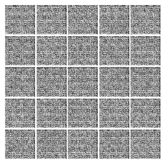

# UniquePrint v1
This is an implemntation of UniquePrintV1. UniquePrintV1 can sythesize the fingerprint from pattern type analysis features (e.g. left, whorl, right, tent arch, arch) using conditional GAN.


# Paper
Synthesizing Fingerprint from Pattern Type Analysis Features using cGAN
</br>[Samuel Lee](https://github.com/prodeveloper0), [Jae-Gab Choi](https://github.com/chlworkq), Jon-Ho Park and Gye-Young Kim</br>
School of Software, Soongsil University
</br>World IT Congress 2019 Jeju ([WITC 2019](http://www.worlditcongress.org/2019/index.php))

# Dependencies
* Python 3.6.7
* OpenCV-Python 3.4.4.19
* TensorFlow 1.10.0

# Usage
## Training
Decompress regularized NIST Special Database 4.
```Bash
$ cd Resources/nist-sd4/
$ unzip nistsd4.part1.zip
$ unzip nistsd4.part2.zip
$ unzip nistsd4.index.zip
```

Change `opt` variable to `train` in `UniquePrintV1.py` file.
```Python
# Parameters
os.environ['CUDA_VISIBLE_DEVICES'] = '0'
database_path = r'Resources/nist-sd4'
name = 'UniquePrintV1_FingerNet'
opt = 'demo' # Change this to 'train' to train UniquePrintV1
checkpoint_epoch = None
batch_size = 150
epoch = 2000
D_learning_rate = 0.0005
G_learning_rate = 0.0005
max_to_keep = 999
```
And, Run `UniquePrintV1.py`
```Bash
$ python3 UniquePrintV1.py
```


## Testing
Change `opt` variable to `demo` in `UniquePrintV1.py` file after training.
```Python
# Parameters
os.environ['CUDA_VISIBLE_DEVICES'] = '0'
database_path = r'Resources/nist-sd4'
name = 'UniquePrintV1_FingerNet'
opt = 'demo' # Change this to 'demo' to demonstrate UniquePrintV1
checkpoint_epoch = None
batch_size = 150
epoch = 2000
D_learning_rate = 0.0005
G_learning_rate = 0.0005
max_to_keep = 999
```
And, Run `UniquePrintV1.py`
```Bash
$ python3 UniquePrintV1.py
```

# Results
Trained 2,000 epoch with NIST Special Database 4.




Output images per epoch (Left) and final output images (Right)
